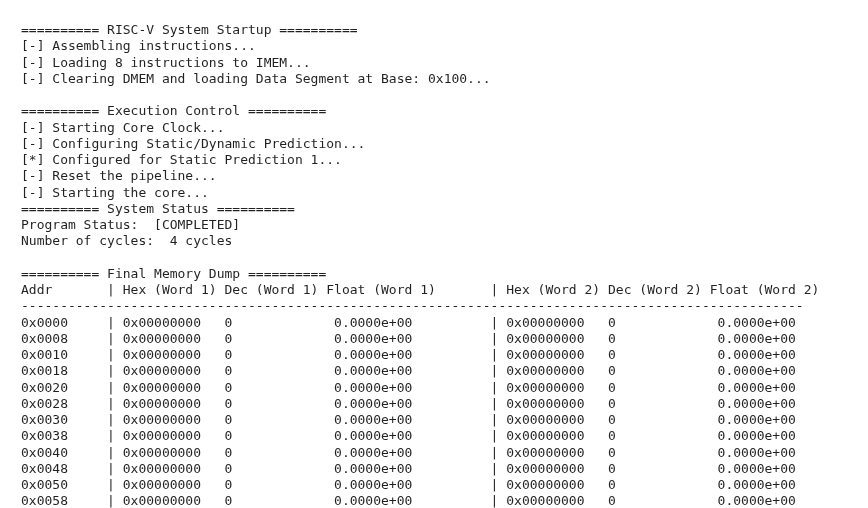

# RISCV Processor implementation on Pynq Z2 FPGA Board

## 🔭 Project Overview

* **Extentsion Specification:** RV64IMFD / RV32IMF
* **Target Board:** PYNQ-Z2 (Zynq-7000 SoC)
* **Clock Frequency:** 10MHz
* **Novelties:** Dynamic branch prediction, Hardware efficient Square Root and Division
## 📝 Report
Report is available [here](report.pdf) and tests are available [here](test_report.pdf).

## ⚙️ Prerequisites

* **Software:**
    * Ubuntu (or other supported Vivado Distros)
    * Xilinx Vivado 2025.1
    * Pynq Board Files (Zynq 7000 series)
    * Iverilog for basic testbenches
* **Hardware:**
    * PYNQ-Z2 Board
    * SD Card with Pynq Bootup files
    * Micro-USB cable (for power)
    * Ethernet cable (for connecting to PYNQ Jupyter interface)

## 💻 Simulation

We use Vivado's built-in simulator to verify the logic and proceed to implementation only if the simulation is working correctly.

1.  Open the project in Vivado.
2.  Upload the hex instructions in the `core/misc/bram_data.coe`.
3.  Navigate to the **Flow Navigator** -> **Simulation**.
4.  Click **Run Simulation** -> **Run Behavioral Simulation**.
5.  The waveform window will appear. You may add any signals you wish to analyze from the scope into the waveform.
6.  Click the **Run** button or press **F3**. 

> **Note:** Ensure your `core` is not the top module. If it is you may have to regenerate the Instruction memory IP.

## 🛠 Synthesis & Bitstream Generation

To generate the `.bit` file and the hardware handoff `.hwh` file:

1.  **Run Synthesis:** Click `Run Synthesis` in the Flow Navigator. Proceed with `Run Implementation` and `Generate Bitstream`.

2. Bitstream and the Hardware Handoff files will be visible at `riscv/riscv.runs/impl_1/design_1_wrapper.bit` and `riscv/riscv.gen/sources_1/bd/design_1/hw_handoff/design_1.hwh` respectively.

## 🔌 Connecting to the board

Please go through the [Pynq Setup](https://pynq.readthedocs.io/en/v2.2.1/getting_started/pynq_z2_setup.html) tutorial before continuing.

Connection to the PYNQ Z2 board will be established through ethernet and power is via MicroUSB. After connecting the ethernet cable to your computer, set the static ip of your computer by running the following script.
```
cd pynq
sudo bash staticip.sh
```
A green light should be blinking on your PYNQ ethernet port.

## 🚀 Running on PYNQ-Z2

We use the PYNQ Python API (Jupyter Notebooks) to load the overlay.

### 1. File Transfer
Move the following files to your PYNQ-Z2 board (via SMB/Samba network share):
* `design_1.bit` (The bitstream)
* `design_1.hwh` (Hardware handoff file - **Must have the same name as the .bit file**)

### 2. Jupyter Script
Connect to `http://192.168.2.99:9090/` on your browser. Make a .ipynb file and paste the jupyter code available at `pynq/jupyter.py`.

Inside the Jupyter Notebook, update the `code` variable with the code and `data_segment` with preloaded data in the data segment.

Press `Run` or `Ctrl+Enter` to run the cell and see the memory map. Something like this should ideally show up with the output of your RISCV Assembly in the memory map.


